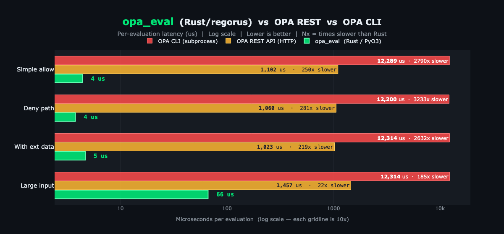

# opa-eval

High-performance OPA policy evaluator for Python — powered by Rust via [PyO3](https://pyo3.rs) + [maturin](https://www.maturin.rs).

## Perf benchmarks



## Prerequisites

- Python 3.8+
- Rust toolchain (`rustup`)
- [maturin](https://www.maturin.rs) (`pip install maturin`)
- [OPA CLI](https://www.openpolicyagent.org/docs/latest/#1-download-opa) (to compile `.rego` policies)

## Quick start

```bash
# Create venv and install dependencies
make venv

# Build the native module and install into the venv
make build

# Run tests
make test
```

Or manually:

```bash
python3 -m venv .venv && source .venv/bin/activate
pip install -r requirements.txt
maturin develop --release
```

## Usage

```python
import opa_eval

# Load a .rego policy (call once at startup)
opa_eval.load_policy("tests/policy.rego", query="data.authz.allow")

# Evaluate per request
result = opa_eval.evaluate('{"role": "admin"}')  # JSON string
parsed = opa_eval.evaluate_parsed('{"role": "admin"}')  # Python object
```

## FastAPI example

```python
from contextlib import asynccontextmanager
from fastapi import FastAPI, Request, HTTPException
import json, opa_eval


@asynccontextmanager
async def lifespan(app: FastAPI):
    opa_eval.load_policy("tests/policy.rego", query="data.authz.allow")
    yield


app = FastAPI(lifespan=lifespan)


@app.middleware("http")
async def authz(request: Request, call_next):
    input_doc = json.dumps({
        "method": request.method,
        "path": request.url.path,
        "role": request.headers.get("x-role", "anonymous"),
    })
    result = opa_eval.evaluate_parsed(input_doc)
    if not result:
        raise HTTPException(403, "denied by policy")
    return await call_next(request)
```

## Development

```bash
make build   # build native extension into venv
make test    # run pytest
make bench   # run benchmarks
make clean   # cargo clean + remove target/
```

## Project structure

```
src/lib.rs        # PyO3 module — load_policy, evaluate, evaluate_parsed
opa_eval.pyi      # Python type stubs
pyproject.toml    # maturin build config
Cargo.toml        # Rust dependencies (pyo3, regorus)
tests/            # pytest tests and benchmarks
```
