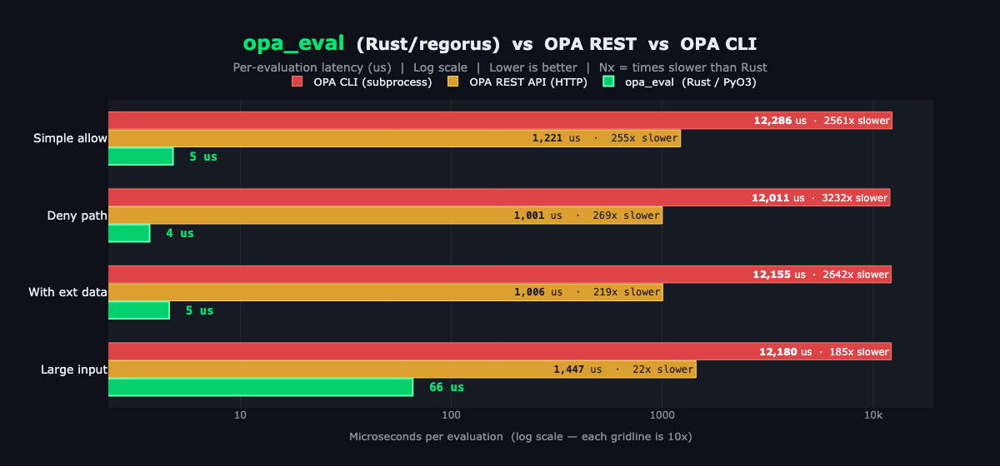

# opa-eval

High-performance OPA policy evaluator for Python — powered by Rust via [PyO3](https://pyo3.rs) + [maturin](https://www.maturin.rs).

## Perf benchmarks



## Prerequisites

- Python 3.9+
- Rust toolchain (`rustup`)
- [maturin](https://www.maturin.rs) (`pip install maturin`)

## Quick start

```bash
# Create venv and install dependencies
make venv

# Build the native module and install into the venv
make build

# Run tests
make test
```

Or manually:

```bash
python3 -m venv .venv && source .venv/bin/activate
pip install -r requirements.txt
maturin develop --release
```

## Usage

```python
import opa_eval

# Create an evaluator instance (one per policy / query)
authz = opa_eval.OpaEval("tests/policy.rego", query="data.authz.allow")

# Evaluate per request
result = authz.evaluate('{"role": "admin"}')         # JSON string → "true"
parsed = authz.evaluate_parsed('{"role": "admin"}')  # Python object → True
```

### With external data

```python
import json, opa_eval

rbac = opa_eval.OpaEval(
    "rbac.rego",
    data_json=json.dumps({"roles": {"alice": "admin", "bob": "viewer"}}),
    query="data.rbac.allow",
)

rbac.evaluate_parsed('{"user": "alice"}')  # True
rbac.evaluate_parsed('{"user": "bob"}')    # False
```

### Multiple independent instances

```python
authz = opa_eval.OpaEval("authz.rego", query="data.authz.allow")
rbac  = opa_eval.OpaEval("rbac.rego",  query="data.rbac.allow")

# Each instance is fully independent and thread-safe
```

## FastAPI example

```python
from contextlib import asynccontextmanager
from fastapi import FastAPI, Request, HTTPException
import json, opa_eval


_authz: opa_eval.OpaEval | None = None


@asynccontextmanager
async def lifespan(app: FastAPI):
    global _authz
    _authz = opa_eval.OpaEval("tests/policy.rego", query="data.authz.allow")
    yield


app = FastAPI(lifespan=lifespan)


@app.middleware("http")
async def authz(request: Request, call_next):
    input_doc = json.dumps({
        "method": request.method,
        "path": request.url.path,
        "role": request.headers.get("x-role", "anonymous"),
    })
    if not _authz.evaluate_parsed(input_doc):
        raise HTTPException(403, "denied by policy")
    return await call_next(request)
```

## Thread safety

Each `OpaEval` instance is thread-safe — `evaluate` and `evaluate_parsed` can be called
concurrently from multiple threads. Independent instances share no state and run fully
in parallel.

## Development

```bash
make build          # build native extension into venv
make test           # run pytest
make bench          # run benchmarks
make bench-compare  # compare vs OPA REST API and OPA CLI
make clean          # cargo clean + remove target/
```

## Project structure

```
src/lib.rs        # PyO3 module — OpaEval class
opa_eval.pyi      # Python type stubs
pyproject.toml    # maturin build config
Cargo.toml        # Rust dependencies (pyo3, regorus)
tests/            # pytest tests and benchmarks
```
